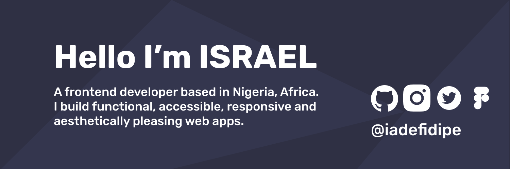

<!--  -->

👋 Hi, I'm Israel - a frontend developer currently working on React projects. I'm a huge CSS fan, UI/UX and web3 enthusiast. I enjoy building responsive and accessible web projects from modern designs.

🛠 My toolbox:

- CSS and a11y
- React
- Next.js
- Figma / Sketch
- Typescript
- Web3.js
- Solidity

## My Github Status 🦸

## 📫 Get in touch

@me on [Twitter](https://twitter.com/iadefidipe) if you want to chat about CSS, a11y, web design, or your project from [Frontendmentor.io](https://www.frontendmentor.io)

My Frontendmentor.io profile: [iadefidipe](https://www.frontendmentor.io/profile/iadefidipe)

LinkedIn: [iadefidipe](https://www.linkedin.com/in/iadefidipe/)
Email: [Israel](israeladefidipe@gmail.com)
